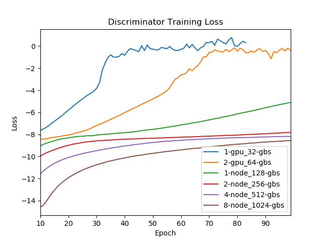
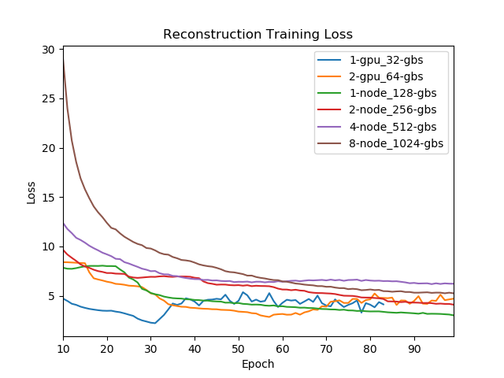

# DDP experiments for the Adversarial Autoencoder (AAE) model.

Our scaling study measures AAE training performance for the following scanarios:

| Nodes       | GPUs        | Global Batch Size |
|    :----:   |    :----:   |    :----:   |
| 1           | 4           | 128         |
| 2           | 8           | 256         |
| 4           | 16          | 512         |
| 8           | 32          | 1024        |

Note: Each GPU has 16GB of memory which can fit a maximum local batch size of 32.

The aae_template.yaml file stores the model hyperparameters and training settings.

We have prepared sbatch submission scripts for each of the above experiments. They can be run as follows:
```
chmod +x ./ddp_aae_experiments/bin/submit_1-node_128-gbs.sh
chmod +x ./ddp_aae_experiments/bin/submit_2-node_256-gbs.sh
chmod +x ./ddp_aae_experiments/bin/submit_4-node_512-gbs.sh
chmod +x ./ddp_aae_experiments/bin/submit_8-node_1024-gbs.sh

sbatch ./ddp_aae_experiments/bin/submit_1-node_128-gbs.sh
sbatch ./ddp_aae_experiments/bin/submit_2-node_256-gbs.sh
sbatch ./ddp_aae_experiments/bin/submit_4-node_512-gbs.sh
sbatch ./ddp_aae_experiments/bin/submit_8-node_1024-gbs.sh
```

We report benchmark results in the following table:

| Nodes       | GPUs        | Global Batch Size | Samples/second | Seconds/batch | Seconds/epoch |
|    :----:   |    :----:   |    :----:   |    :----:   |    :----:   |    :----:   |
| 1           | 4           | 128         | -           | -           | -           |
| 2           | 8           | 256         | -           | -           | -           |
| 4           | 16          | 512         | -           | -           | -           |
| 8           | 32          | 1024        | -           | -           | -           |

Here are the loss curves for the following runs, generated by running the script:
```
idev -m 5 -n 1 -N 1
module load conda
conda activate /scratch/06079/tg853783/ddmd/envs/pytorch.mpi
cd /scratch/06079/tg853783/ddmd/src/DeepDriveMD-Longhorn-2021/ddp_aae_experiments
python generate_loss_curves.py
```




